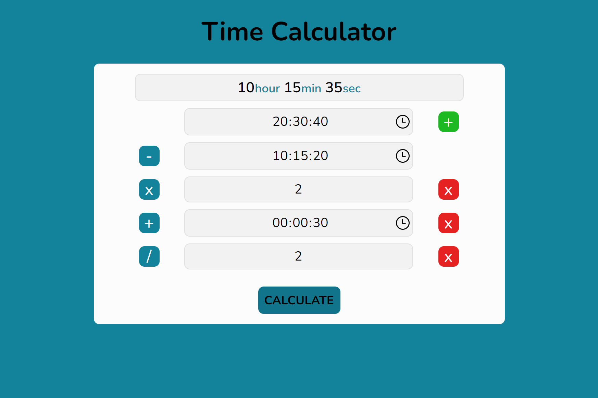
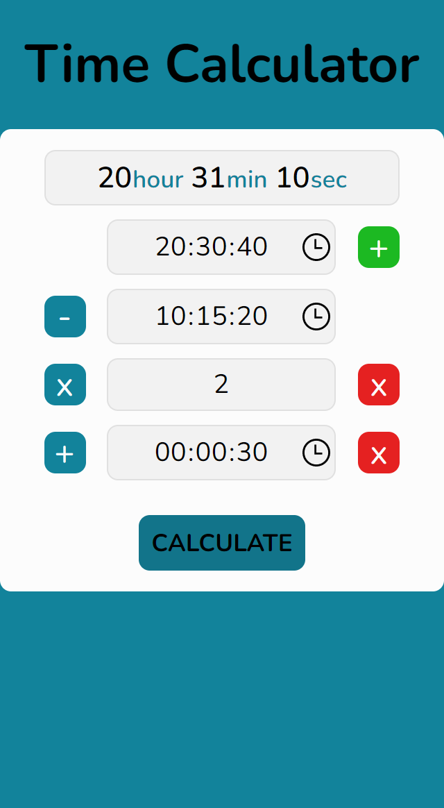

<h1 align="center">
  🕓 Time Calculator
  
</h1>

 <a href="#1">Sobre</a> •
 <a href="#2">Layout Mobile</a> • 
 <a href="#3">Layout Mobile</a> • 
 <a href="#4">Licenças</a>

---

### 💡 Sobre

Esta é uma aplicação web criada para atender a necessidade de fazer operações matemáticas básicas com horários. Criada predominantemente com JavaScript Vanilla, utilizando manipulação de DOM para aplicar e obter elementos na tela.

---

### 📲 Layout Mobile

---

### 🎁 Contribua

Se possível dê uma olhadinha no código, acredito q tem muito o que melhorar e não tenho dúvidas de que você pode me ajudar e ajudar a outros que possivelmente venham a ver esse repositório.

Pull Requests são sempre bem-vindos!

### 📝 Licença
⚖ Este projeto está sob a licença - [MIT](https://github.com/arimariojesus/Time-Calculator/blob/master/LICENSE)

---

Made with 💙 by <a href="https://www.linkedin.com/in/arimario-jesus">Arimário Jesus</a>
